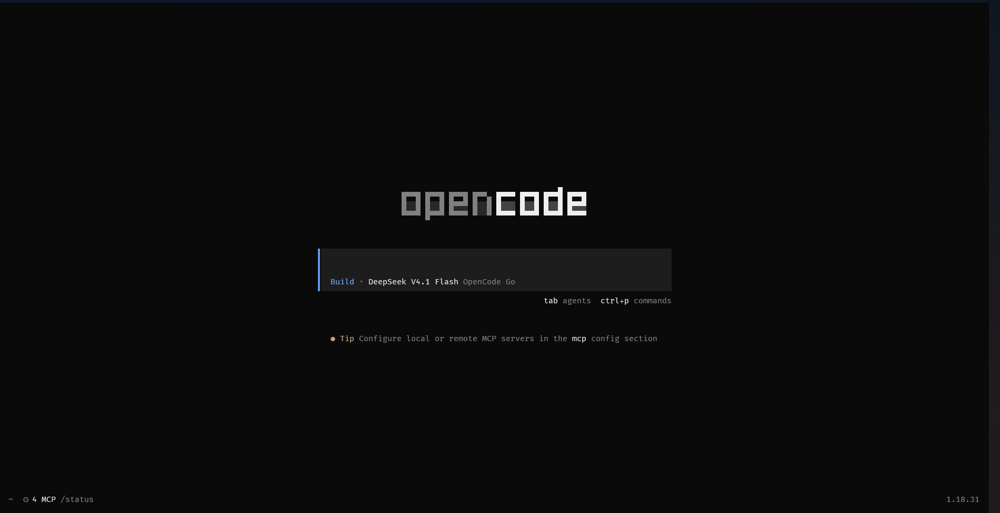

# opencode-dictate

**Hands-free voice conversation mode for [opencode](https://opencode.ai).** Speak your
prompts, let the agent answer your permission prompts and questions by voice, and
watch a little status scanner react to your voice — no keyboard required.

<p align="center">
  
</p>

> Early development (0.1.x): the API and config may change. Verified on **Linux/WSL
> and macOS** with the bundled recorder — nothing to install. Windows falls back to
> `ffmpeg` and is untested (see [Cross-platform](#cross-platform)).

## What it does

- **Dictate into the prompt** — record one utterance, it lands in the input.
- **Conversation mode** — keep talking; each utterance is sent straight to the
  agent. While the agent is busy, opencode's own queue holds them.
- **Answer by voice** — when the agent asks a question or requests a permission,
  speak your answer: it is submitted for you (`question.reply` / `permission.reply`).
- **Voice kill switch** — say *"stop"* to abort the agent; *"stop conversation mode"*
  to leave hands-free mode. Decisions are made by an LLM, not keyword matching.
- **Status indicator** — centred above the prompt, coloured by state
  (red speaking · amber transcribing · dim silent · violet muted · white pulse
  stopped), in two styles: a **KITT/Knight-Rider scanner** or a live **amplitude wave**.
- **Mute** — one key shuts the microphone off completely: nothing is captured at
  all (not captured-and-discarded), the scanner parks in violet, and the setting
  survives restarts.

## The indicator

It sits just above the prompt, and it is the whole user interface:

Two styles, switched with `f7`: a **KITT-style scanner** (a bright sweep that
travels along the bar) and an **amplitude wave** (bars that follow your loudness).
The colour tells you what is happening:

| Colour | Meaning |
|---|---|
| `#4E545A` grey | listening — nothing said yet (or the pause between sentences) |
| `#FF5555` red | your voice is being captured right now |
| `#E0A64B` amber | the utterance is being transcribed |
| `#FFFFFF` white | a brief flash after a spoken stop |
| `#8A6FD6` violet | muted — the microphone is not opened at all |

`f7` switches between the KITT-style scanner and the amplitude wave; `f8` mutes.
When opencode asks you a question or for permission, the label beside the bar
says so and you can simply answer out loud.

## Requirements

- opencode with TUI plugin support (a `plugin` entry in `opencode.json`).
- A **speech-to-text backend** (see below) — local or cloud.
- An **OpenAI-compatible LLM** for transcript cleanup + control sentinels
  (optional but recommended; without it, raw transcripts are used and voice
  commands such as "stop" are unavailable).

## Install

```bash
opencode plugin opencode-dictate -g          # installs the package and updates tui.json
# restart opencode, then press f10 and talk
```

Then restart opencode. The first start takes a few seconds while the package is
fetched.

To configure it, turn that entry into a `[spec, options]` tuple in
`~/.config/opencode/tui.json`:

```jsonc
{
  "$schema": "https://opencode.ai/tui.json",
  "plugin": [
    ["opencode-dictate", { "stt": "http://127.0.0.1:8080/v1" }]
  ]
}
```

Prereleases are published under the `beta` dist-tag (`opencode-dictate@beta`).

> Listing the same package in `opencode.json` works too (it resolves against the
> host runtime); `tui.json` is the conventional place for TUI plugins.

> **For plugin authors:** a TUI plugin loaded from npm must bring its own runtime.
> Declare `solid-js`, `@opentui/core` and `@opentui/solid` as dependencies — the
> host has no on-disk copy to resolve them from, and a plugin that imports them
> without declaring them is skipped silently.

### From local files (development)

Copy the sources into your config directory and point `tui.json` at the file:

```bash
mkdir -p ~/.config/opencode/tui-plugins/opencode-dictate
cp src/* ~/.config/opencode/tui-plugins/opencode-dictate/
```

```json
{
  "$schema": "https://opencode.ai/tui.json",
  "plugin": ["./tui-plugins/opencode-dictate/index.tsx"]
}
```

This is also the fastest way to iterate on the plugin itself.

## Controls

| Key | Slash command | Action |
|---|---|---|
| `f9` / `<leader>d` | `/dictate` | record one utterance into the prompt |
| `f10` / `<leader>v` | `/converse` | toggle conversation mode (open mic) |
| `f8` / `<leader>m` | `/mute` | mute / unmute the microphone |
| `f7` | `/indicator` | switch indicator style (scanner ↔ wave) |

All four are also in the command palette. `<leader>` is opencode's leader key.

## Configuration

You only need to point the plugin at **speech-to-text** — cleanup and voice
commands reuse the LLM opencode is already configured with. Configure it in
`opencode.json` via plugin options:

```json
{
  "$schema": "https://opencode.ai/config.json",
  "plugin": [
    ["opencode-dictate", { "stt": "http://127.0.0.1:8080/v1" }]
  ]
}
```

```jsonc
// or the object form
["opencode-dictate", { "stt": { "url": "https://api.openai.com/v1", "key": "sk-…", "model": "whisper-1" } }]
```

| Option | Meaning |
|---|---|
| `stt` | `"http://…/v1"` or `{ url, key, model }` — any OpenAI-compatible `/audio/transcriptions` |
| `llm` | *optional* override; default is the LLM opencode uses (`small_model`, else `model`) |
| `backend` | `"builtin"` \| `"command"` \| `"auto"` (default `auto`) |
| `command` | command to run for `backend: "command"` (default `dictate`) |
| `silenceMs` / `maxMs` / `startTimeoutMs` | utterance endpointing (defaults 900 / 60000 / 4000) |
| `minSpeechMs` | voiced audio required before a clip is transcribed (default 300) |
| `vadThreshold` | peak amplitude that counts as voice; raise it in a noisy room (default 0.03) |
| `inputGain` / `autoGain` | fixed gain 0..1, or let the plugin trim a hot mic itself (default auto) |
| `speaker` | `{ enabled, threshold, artifactThreshold, minSamples }` — MFCC voiceprint gate (defaults 0.8 / 0.9 / 8) |
| `inputDevice` | microphone override: a name substring (e.g. `"AirPods"`) or an index (`":1"`); omit for the OS default |
| `debug` | write a debug log (same as `VOICE_DEBUG=1`) |

Environment variables (`VOICE_STT_URL`, `VOICE_LLM_URL`, `VOICE_SILENCE_MS`, …)
still work and are overridden by plugin options.

**Auto-detection:** if no STT is configured the plugin probes
`http://127.0.0.1:8080/v1` and uses it when a local server answers; on Linux it
also sets `PULSE_SERVER` for WSLg automatically.

**Noise and hallucinations:** Whisper-family models invent phrases ("Thank
you.", "To be continued…") when handed silence or room noise, and cloud
endpoints don't expose the server-side VAD a local server does. The plugin
therefore discards a transcript when the clip's loudest peak never clearly rose
above the noise (below 1.5x `vadThreshold`), and separately discards known
artifacts. A third guard is physical rather than textual: a transcript that could
not have been spoken in the time actually recorded is dropped, measured against
*your* own speaking pace (flag above 2.5x it, never below 8 words/second). If
phantom prompts appear, raise `vadThreshold`; if it stops hearing you, lower it.
Set `debug: true` and the log records every keep/drop with the audio levels so
the threshold can be tuned from data.

**Speaker verification (optional):** with `speaker.enabled`, each clip is turned
into an MFCC voiceprint (no model, no dependencies) and compared by cosine
similarity to a profile that keeps learning as you talk — accepted clips are
folded back in, so it follows your voice when the microphone or your delivery
changes. It accepts everything until `minSamples` utterances are enrolled, then
drops clips below `threshold` (0.8 by default). Whisper's stock phrases ("Thank
you.", "To be continued…") are held to a stricter `artifactThreshold` (0.9),
since they are almost never genuine. The profile lives at
`~/.local/share/opencode/opencode-dictate/voiceprint.json`; delete that file to
re-enroll. This is intentionally simple, so treat the threshold as a soft gate
and tune it from the `debug` log.

**Recorders:** nothing to install. The package ships its own tiny recorder
(miniaudio, MIT-0) for **macOS arm64/x64** and **Linux x64**, and uses it
automatically — it talks to CoreAudio/ALSA/PulseAudio directly. Only if no
bundled build matches your platform does it fall back to the first of `ffmpeg`,
`parecord`, `arecord`, `sox` on `PATH`. Whichever runs, it writes raw 16 kHz mono
PCM to stdout and stops itself at the deadline, so no temp files exist and a
killed TUI cannot leave a recorder holding the microphone.

**Choosing the microphone.** By default the plugin uses whatever the OS currently
treats as the default input, and it re-resolves that for **every** utterance — so
plugging in a headset mid-session is picked up on your next sentence without a
restart. To pin a specific device, set `inputDevice` to a name substring (safer:
indices are renumbered when devices come and go) or to an exact index. List the
names on your machine with:

```bash
node_modules/opencode-dictate/bin/$(uname -s | tr 'A-Z' 'a-z')-*/opencode-dictate-recorder --list
```

On macOS, grant the terminal app microphone permission (System Settings →
Privacy & Security → Microphone); a GUI-launched opencode has no
`/opt/homebrew/bin` on `PATH`, so start it from Terminal. On Windows, add
`inputDevice: "Microphone (…)"` if the default DirectShow device is wrong. Set
`VOICE_DEBUG=1` to log to `VOICE_DEBUG_LOG` (default
`/tmp/opencode/dictate-plugin.log`).

With `backend: "command"` the plugin instead runs an external `dictate` command
(e.g. a local GPU build).

See `servers/faster-whisper/` for a dependency-free local STT server.

## Architecture

The plugin is a thin TUI layer that orchestrates two pluggable pieces:

```
plugin:  capture (recorder stream) + VAD (endpointing) + cleanup + loop + UI
         — 16 kHz PCM read from the recorder's stdout and assembled in memory,
           so no temp files exist and the level is live on every platform
         └── audio -> transcript   (local whisper server | cloud API)
```

- **Capture + VAD stay local** (mic access is local by nature; Silero/energy VAD is
  cheap and gives conversation mode its utterance boundaries).
- **ASR is swappable** — a local GPU server or a cloud API.
- **Cleanup + control sentinels** are an LLM step (local or cloud).

## Troubleshooting

Start with `debug: true` and watch the log (default
`/tmp/opencode/dictate-plugin.log`, override with `VOICE_DEBUG_LOG`). Every clip
logs why it was kept or dropped — `keep`, `drop weak audio`,
`drop silence hallucination`, `drop impossible speech rate`,
`drop other speaker` — with the audio levels behind the decision.

| Symptom | What to try |
|---|---|
| `no recorder found` | your platform has no bundled build (Windows, Linux arm64) — install `ffmpeg` |
| Never hears you | lower `vadThreshold` (try 0.02); check the logged `peak=` |
| Phantom prompts | raise `vadThreshold`; enable `speaker`; the log names the reason |
| Your own words dropped | lower `speaker.threshold`, or delete the voiceprint to re-enroll |
| Hears other people | enable `speaker` and keep `threshold` at 0.8 or above |
| A recorder left running | can't happen indefinitely: each recorder carries its own deadline (~63s) and exiting the TUI kills whatever is live |
| Nothing is transcribed on macOS | the recorder must be found on `PATH` — a GUI-launched app has no `/opt/homebrew/bin`, so start opencode from Terminal |

### Debugging why it does not work

Set `debug: true` in the plugin options (or `VOICE_DEBUG=1`) and watch the log —
default `/tmp/opencode/dictate-plugin.log`. Every utterance ends in **exactly one**
decision line, which is enough to explain almost any problem:

```
keep    (voiced=2160ms peak=0.231 pitch=0.72 clip=0.000 gain=1.000) transcript="…"
drop weak audio (voiced=640ms peak=1.000 pitch=0.60 clip=0.012 gain=1.000) …
drop silence hallucination (…) / drop impossible speech rate (…) / drop wordless transcript (…)
```

| Field | Meaning | What it tells you |
|---|---|---|
| `voiced` | ms of audio above the speech threshold | `0` while you speak → the mic is silent or the wrong device |
| `peak` | loudest sample, 0..1 | near `1.000` with `clip>0` → the input is overdriven |
| `pitch` | quasi-periodicity, 0..1 | below `0.15` is a knock or a door, not a voice |
| `clip` | share of saturated samples | any value means the signal was already flattened upstream |
| `gain` | input gain used for that capture | shows whether your setting took effect |

Checklist, in the order worth trying:

| Symptom | Cause and fix |
|---|---|
| `no recorder found` | your platform has no bundled build (Windows, Linux arm64) — install `ffmpeg` |
| Grey forever, `peak=0.000` | the microphone is muted, wrong, or the OS is not delivering audio — check the level meter in your sound settings, then set `inputDevice` to a name |
| Nothing at all on macOS | grant the terminal **Microphone** permission, and start opencode from Terminal (a GUI launch has no `/opt/homebrew/bin` on `PATH`) |
| Your own words dropped as *weak audio* | too much attenuation: raise `inputGain`, or lower the OS input volume instead of the plugin's |
| `clip` above zero on every sentence | the source is too hot *before* the plugin sees it — lower the OS input level (e.g. `pactl set-source-volume RDPSource 60%`) |
| Phantoms ("Thank you.", ".") | raise `vadThreshold`; enable `speaker` in a noisy or shared room; keep `minSpeechMs` at 300+ |
| Sentences cut in half | raise `silenceMs` (900 → 1200) |
| Messages sent while you pause to think | raise `silenceMs` (900 → 2500): the microphone stays open through the pause, so a resumed sentence becomes **one** message instead of two |
| Long dictation truncated | raise `maxMs` (default 60000) |

### Tuning it to your liking

| You want | Change |
|---|---|
| to catch quieter speech | `vadThreshold` 0.05 → 0.03, and/or `inputGain` up |
| to stop reacting to room noise | `vadThreshold` up (0.05 → 0.08) and `minSpeechMs` up |
| more time to think mid-sentence | `silenceMs` up — costs the same delay on sentences you *had* finished |
| to ignore other speakers | `speaker: { enabled: true }` — it learns your voice from accepted utterances (delete `…/opencode-dictate/voiceprint.json` to re-enrol) |
| a different microphone | `inputDevice` as a name substring, e.g. `"AirPods"` |

State it keeps, all under `~/.local/share/opencode/opencode-dictate/`:
`audio.json` (input gain), `voiceprint.json` (your voice), `speech-rate.json`
(your speaking pace). Deleting any of them resets that piece of learning.

## Cross-platform

| OS | Status |
|---|---|
| Linux x64 / WSL | working (bundled recorder, no install) |
| macOS arm64/x64 | working (bundled recorder, no install; needs mic permission) |
| Windows | implemented (`ffmpeg dshow`, auto-picks the first audio device) |

macOS and Windows are code-complete but untested on real hardware here — the
device auto-detection has not been run on those platforms.

## Roadmap

Planned, roughly in order of value:

- **Smarter end-of-utterance.** Today `silenceMs` is a blunt fixed wait. The better
  behaviour is to send immediately when a sentence sounds finished and only grant
  extra time when the transcript looks half-recorded (no terminal punctuation, or
  the LLM judging it incomplete), merging whatever follows into the same message.
- **Adaptive noise floor.** Track the room's noise floor on non-speech frames and
  set the speech threshold at ~3× it, with hysteresis and a hangover. Removes the
  manual `vadThreshold` and the last of the quiet-room false triggers.
- **One gain semantics.** `inputGain` currently means different things per
  recorder (parecord's `--volume` is weakly nonlinear, arecord ignores it). Apply
  gain to the PCM we read, so it means the same everywhere.
- **Recorders for Windows and Linux arm64** — those platforms still fall back to
  `ffmpeg`/`parecord`/`arecord`/`sox`.

## License

MIT — see [LICENSE](./LICENSE).
